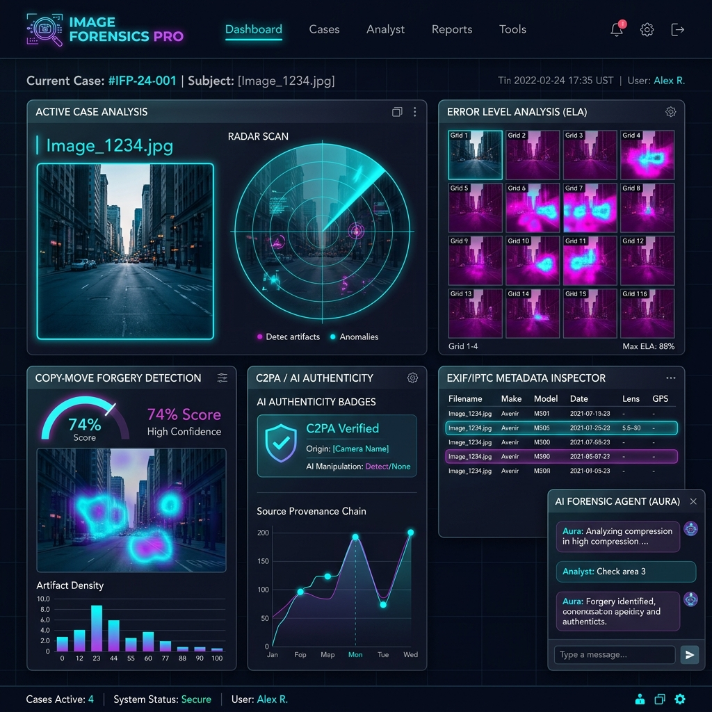
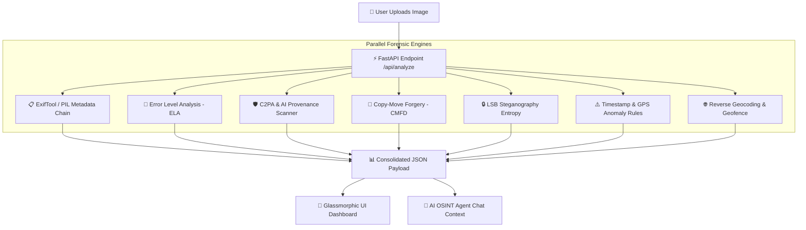

# 🕵️ Image Forensics Pro (OSINT Vision Pro)

<p align="center">
  
</p>

<p align="center">
  <a href="https://github.com/KaloNakre/image-forensics-pro/actions"></a>
  <a href="https://python.org"></a>
  <a href="https://fastapi.tiangolo.com"></a>
  <a href="https://opencv.org"></a>
  <a href="LICENSE"></a>
</p>

---

## 📖 Overview

**Image Forensics Pro** is an open-source, multi-layered digital image forensics and visual intelligence platform. Built with **FastAPI**, **OpenCV**, and **ExifTool**, it provides OSINT researchers, cybersecurity analysts, and digital forensic investigators with advanced tools to verify image authenticity, detect AI generation, identify copy-move manipulations, scan for hidden steganography payloads, and analyze geospatial metadata.

---

## ⚡ Key Forensic Features

| Module | Technique / Engine | Description |
| :--- | :--- | :--- |
| 📋 **Metadata Inspector** | ExifTool CLI $\rightarrow$ ExifRead $\rightarrow$ PIL | Multi-layered fallback chain extracting EXIF, IPTC, XMP, device serial numbers, and camera maker notes. |
| 🧪 **Error Level Analysis (ELA)** | Differential Compression | Computes JPEG compression variance (default 95% quality) to highlight spliced or digitally manipulated image regions. |
| 🛡️ **C2PA & AI Authenticity** | JUMBF / PNG Chunk Scanner | Scans binary headers for C2PA Content Credentials and detects footprints from AI generators (Midjourney, DALL-E, Stable Diffusion, Flux, etc.). |
| 🧩 **Copy-Move Forgery (CMFD)** | OpenCV ORB & KNN Matching | Detects duplicated image blocks and cloned regions using keypoint spatial distance descriptors. |
| 🔒 **LSB Steganography Scan** | Shannon Bitplane Entropy ($H$) | Evaluates Least Significant Bit entropy variance and 1-bit ratios to flag encrypted/hidden data payloads. |
| ⚠️ **Timeline & GIS Sanity** | Anomaly Rule Engine | Flags future dates, pre-digital timestamps, Null Island coordinates, and abnormal altitudes. |
| 🇧🇩 **Geospatial Geofencing** | OpenStreetMap Nominatim | Reverse geocoding with bounding box verification for Bangladesh coordinates. |
| 🤖 **AI Forensic Agent** | LLM Contextual Investigator | Interactive assistant that synthesizes multi-layer forensic verdicts and guides investigation steps. |

---

## 🏗️ Architecture & Forensic Pipeline



---

## 📁 Repository Structure

```text
image-forensics-pro/
├── .github/
│   └── workflows/
│       └── ci.yml             # Automated GitHub Actions test workflow
├── assets/
│   └── dashboard_preview.png  # Dashboard UI screenshot
├── main.py                    # Primary FastAPI backend & forensics engine
├── osint-vision-pro.html      # Glassmorphic UI dashboard with motion graphics
├── start_server.py            # Easy server launcher script
├── test_app.py                # Pytest unit & integration tests
├── requirements.txt           # Python dependencies manifest
├── .gitignore                 # Git ignore configuration
├── CONTRIBUTING.md            # Guidelines for open-source contributors
├── LICENSE                    # MIT License file
└── README.md                  # Comprehensive documentation
```

---

## 🛠️ Prerequisites & Installation

### 1. System Prerequisites

- **Python**: Version 3.9 or higher.
- **ExifTool (Recommended)**: Install system `exiftool` for complete MakerNotes and raw tag extraction:
  - **Linux (Ubuntu/Debian)**: `sudo apt install libimage-exiftool-perl`
  - **macOS**: `brew install exiftool`
  - **Windows**: Download standalone executable from [ExifTool Official Website](https://exiftool.org/) and add to `PATH`.

### 2. Clone & Install Dependencies

```bash
# Clone repository
git clone https://github.com/KaloNakre/image-forensics-pro.git
cd image-forensics-pro

# Create virtual environment (optional but recommended)
python -m venv venv
# On Windows:
venv\Scripts\activate
# On Linux/macOS:
source venv/bin/activate

# Install required Python packages
pip install -r requirements.txt
```

---

## 🚀 How to Run and Use

### Option 1: Using Launcher Script (Easiest)

Run the included `start_server.py` script:

```bash
python start_server.py
```

### Option 2: Using Uvicorn Directly

```bash
uvicorn main:app --reload --host 0.0.0.0 --port 8000
```

Once started, open your web browser and navigate to:
👉 **`http://localhost:8000`**

---

## 💻 API Usage & Developer Examples

### 1. Analyze an Image via REST API (`curl`)

```bash
curl -X POST "http://localhost:8000/api/analyze" \
  -F "file=@/path/to/target_image.jpg"
```

### 2. Analyze an Image via Python Script

```python
import requests

url = "http://localhost:8000/api/analyze"
files = {"file": open("sample.jpg", "rb")}

response = requests.post(url, files=files)
data = response.json()

print(f"Extractor Used: {data['exif']['extractor_used']}")
print(f"AI Generated: {data['c2pa_ai']['is_ai_generated']}")
print(f"Copy-Move Forgery: {data['copy_move']['forgery_detected']}")
print(f"LSB Entropy: {data['steganography']['lsb_entropy']}")
```

### 3. Query the AI Forensic Agent

```python
import requests

url = "http://localhost:8000/api/agent/chat"
payload = {
    "message": "Is this image edited or generated by AI?",
    "model": "claude-3-5-sonnet",
    "image_context": data  # Pass context returned from /api/analyze
}

res = requests.post(url, json=payload)
print(res.json()["reply"])
```

---

## 📡 API Reference Table

| Endpoint | Method | Input | Description |
| :--- | :--- | :--- | :--- |
| `/` | `GET` | None | Serves the glassmorphic interactive web dashboard. |
| `/api/analyze` | `POST` | `multipart/form-data` (`file`) | Runs full 7-layer forensic analysis and returns structured JSON. |
| `/api/ela` | `POST` | `multipart/form-data` (`file`, `quality`) | Runs standalone Error Level Analysis. |
| `/api/agent/chat` | `POST` | `JSON` (`message`, `model`, `image_context`) | Interactive AI forensic assistant query endpoint. |
| `/api/health` | `GET` | None | Health check and active forensic modules inspection. |

---

## 🧪 Running Unit Tests

Run the test suite to verify backend endpoints and forensic engine logic:

```bash
pytest test_app.py -v
```

---

## 🤝 Contributing

Contributions are welcome! Please read [`CONTRIBUTING.md`](CONTRIBUTING.md) for guidelines on opening issues, feature requests, and submitting pull requests.

---

## 📜 License

Distributed under the **MIT License**. See [`LICENSE`](LICENSE) for details.
